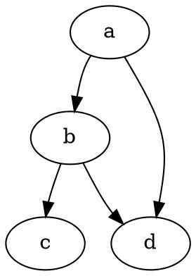
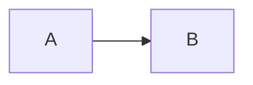

mermaid xkcd
# test_mermaid

$$
sum_(i=1)^n i^3=((n(n+1))/2)^2
$$

digraph graphname {
  splines="curved";
  a -> b -> c;
  b -> d -> a;
}

The following code-block will be rendered as a Mermaid diagram:

